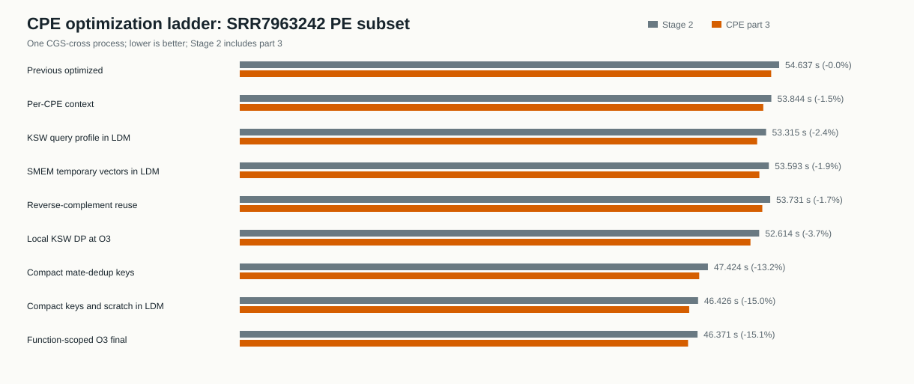
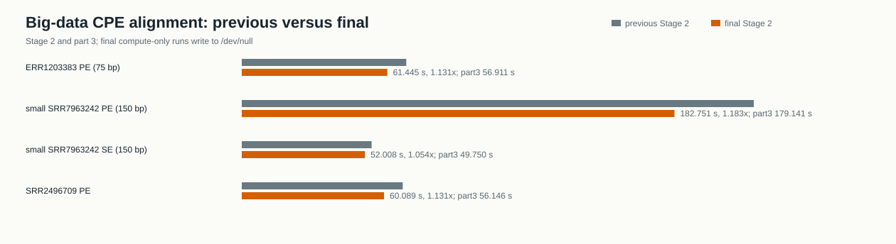
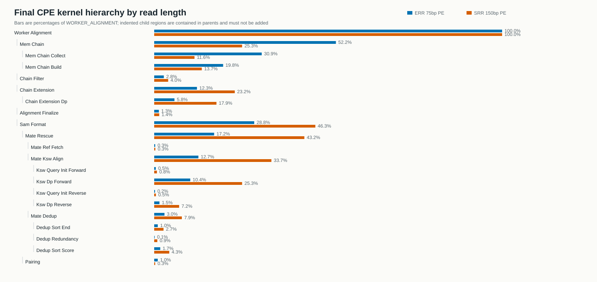

# CPE kernel 与 LDM 优化报告

## 结论

本轮在 `cgs_cross + pool`、单节点、单主进程配置下，对 Stage2 的从核路径做了定点优化。最终版本没有改变比对模型和输出格式，已覆盖 75 bp、150 bp、PE、SE 和大数据正确性检查。

相对上一版已优化代码：

- `SRR7963242 PE` 子集 Stage2 从 `54.637 s` 降至 `46.371 s`，加速 `1.178x`；CPE part3 从 `53.830 s` 降至 `45.411 s`，加速 `1.185x`。
- 四个大数据 case 的 Stage2 加速为 `1.054x` 到 `1.183x`，CPE part3 加速为 `1.058x` 到 `1.189x`。
- 最大收益来自 mate-rescue 去重排序：只排序 24 字节紧凑键，并将常见排序键和重排 scratch 放进 LDM；不是来自盲目增加 DMA。
- 保持 `-cache_size 128` 更合理。剩余 128 KiB LDM 中，持久对象约 17.5 KiB，KSW 或排序瞬时最多再使用 64 KiB，两者不同时存活。
- 不建议给 BWT 主路径增加 DMA/RMA。BWT 是约 3 GB、地址依赖的随机访问，无法形成有效的大块异步搬运；最终 profile 中适合连续 DMA 的 mate reference fetch 只占总周期约 `0.3%`。



## 实现内容

### 每个 CPE 复用比对上下文

`slave/bwamem.c` 和 `slave/slave.c` 为一次 worker kernel 创建一个 CPE 私有上下文：

- BWT 元数据只复制一次，不再每条 read 都 `ldm_malloc/copy/free`。
- `smem_aux_t` 在同一个 CPE 的动态任务之间复用。
- 标准 CG、CGS 和 `cgs_cross` 共用同一实现。

### SMEM 临时向量进入 LDM

两条常用 `bwtintv_t` 临时向量各预留 256 项，共 16 KiB。read 长度小于 256 bp 时使用 LDM；更长 read 自动回退到原堆向量。`bwt_smem1a()` 中每条临时向量最多增长到 query 长度，因此不会对 LDM 地址调用 `realloc()`。

### mate-rescue KSW 数据局部化

- query profile 及 DP 工作区在不超过 64 KiB 时使用 `ldm_malloc()`，否则回退到 CPE allocator。
- 反向互补序列在四种配对方向之间复用，不再按方向重复构造。
- 仅 `ksw_u8()` 和 `ksw_i16()` 使用函数级 `O3`；主链 extension 的 `ksw_extend2()` 保持全项目默认 `O2`。

整份 `slave/ksw.c` 强制 `O3` 曾令 150 bp SE 的 part3 从基线 `52.641 s` 回退到 `55.449 s`。缩小优化范围后，最终 part3 为 `49.750 s`，说明 Sunway 编译器上的优化等级必须按 kernel 选择。

### mate-rescue 去重排序

原实现直接对约 88 字节的 `mem_alnreg_t` 做两次 introsort。新实现仅在不执行 patch 的 mate-rescue 去重路径上：

1. 用 24 字节键按 reference end 排序，并按索引一次性重排完整记录。
2. 完成 redundancy 过滤后，用紧凑键按 score/reference begin/query begin 排序。
3. 键和完整记录 scratch 总计不超过 64 KiB 时放进 LDM，超限自动回退 CPE allocator。

比较器字段及 introsort 控制流程与原实现一致；普通单端去重与需要 patch 的路径仍使用原 `mem_alnreg_t` 排序。

### 其他

- 删除静态 SAM 大缓冲分配后的 1.5 GiB 无用初始化。
- 增加可编译为空操作的 LWPF 父子 region，用于拆分 SMEM、extension DP、mate KSW 和 dedup。

## 大数据性能

下表的 previous 来自 `correctness_results/cpe_bigdata_opt_20260825/has1`。final 是最终 `CPE_PROFILE=0` 版本；为隔离共享文件系统写波动，性能复测输出到 `/dev/null`，但完整 SAM 正确性由单独运行验证。

| case | previous Stage2 | final Stage2 | speedup | previous part3 | final part3 | speedup |
| --- | ---: | ---: | ---: | ---: | ---: | ---: |
| ERR1203383 PE, 75 bp | 69.469 s | 61.445 s | 1.131x | 65.233 s | 56.911 s | 1.146x |
| small SRR7963242 PE, 150 bp | 216.244 s | 182.751 s | 1.183x | 212.954 s | 179.141 s | 1.189x |
| small SRR7963242 SE, 150 bp | 54.837 s | 52.008 s | 1.054x | 52.641 s | 49.750 s | 1.058x |
| SRR2496709 PE | 67.978 s | 60.089 s | 1.131x | 64.320 s | 56.146 s | 1.146x |

最终三组 `/dev/null` PE 复测的输入带宽为 `96.8` 到 `103.9 MiB/s`，没有异常慢 I/O 节点。



完整数值见 [bigdata_stage2.tsv](analysis/bigdata_stage2.tsv)。

## 最终热点

LWPF 数值为抽样 CG 的 64 个 CPE 平均值。父 region 包含缩进的子 region，不能相加。

### 150 bp PE

- worker alignment：`95G` cycles。
- SAM format：`44G`，其中 mate rescue `41G`。
- mate KSW：`32G`，其中 forward DP `24G`、reverse DP `6.8G`。
- MEM chain：`24G`；chain extension：`22G`，其中 extension DP `17G`。
- mate dedup：`7.55G`，已从 compact-key 之前约 `19G` 大幅下降。
- mate reference fetch：`0.309G`，仅 worker 的 `0.33%`。

### 75 bp PE

- worker alignment：`7.07G` cycles。
- MEM chain：`3.69G`，占 `52.2%`，是短读主热点。
- SAM format：`2.03G`；mate rescue `1.22G`；mate KSW `0.90G`。
- mate dedup 只占 `0.21G`，所以 compact-key 对 75 bp 的收益小于 150 bp。



完整 counter、min/max 和 D-cache miss 见 [final_hotspots.tsv](analysis/final_hotspots.tsv)。

## LDM、cache、DMA 与 RMA 判断

本次运行使用 `-cache_size 128`，即 256 KiB CPE 本地存储中约 128 KiB 交给自动 cache，剩余空间供栈和手动 LDM 使用。

手动 LDM 峰值预算：

- 持久 BWT 元数据与上下文约 1.1 KiB。
- 持久 SMEM 临时向量 16 KiB。
- KSW query/DP 或 dedup sort storage 最多 64 KiB；二者不同时存活。
- 常见峰值约 81.5 KiB，仍给栈和运行时保留约 46 KiB。

增大自动 cache 会直接压缩上述手动 LDM 余量。150 bp profile 的总 D-cache miss 为约 23M/6388M accesses；其中 21M 来自随机 BWT chain，128 KiB 与稍大的 cache 都无法容纳约 3 GB BWT，因此不值得用 LDM 安全余量换少量 cache 容量。

DMA 适合已知地址、连续且可批量的搬运。BWT 的下一地址依赖当前 Occ 结果，单次有效数据只有几十字节，已有注释掉的 DMA 试验也会把启动与等待开销放在关键依赖链上。RMA 用于 CPE 间通信，而当前 read 任务彼此独立；增加 RMA 只会引入同步，不会减少计算。

下一步若继续优化，应优先研究：

1. 150 bp 的 `ksw_u8/ksw_i16` 指令调度和 SIMD 数据流。
2. 75 bp 的 BWT Occ 计算、预取距离与 MEM chain build。
3. mate dedup 的小规模排序分布，再决定是否实现保持 tie 语义的专用小数组排序。

## 正确性

本轮没有发现输出变化：

- 最终函数级 `O3` 的 `SRR7963242 PE` 子集：MD5 `a799dc7268f389120ec92820e04b5118`，`5,033,412` 行，`2,107,655,733` 字节。
- 最终函数级 `O3` 的 small `SRR7963242 SE` 大数据：MD5 `b2ea694f6a08a3424dece15f1b8e8114`，`10,057,343` 行，`3,920,595,145` 字节。
- 同一算法版本的大数据 ERR PE、small SRR PE、SRR2496709 PE 分别通过 `dc5c0a6babd41641db22808caedb7a44`、`215c1ee5deddbef3647d94b90e841834`、`b318cf90a083eafc9aa4c461bf023f90`。之后只缩小了 KSW 编译优化范围，并再次验证了 PE 子集与 SE 大数据。

## 复现

构建性能版本：

```bash
bash build_cross.sh \
  EXEC_MODE=cgs_cross CPE_ALLOCATOR=pool CPE_PROFILE=0 USE_MPI=0
```

构建 LWPF 版本：

```bash
bash build_cross.sh \
  EXEC_MODE=cgs_cross CPE_ALLOCATOR=pool \
  CPE_PROFILE=1 CPE_PROFILE_CG=5 USE_MPI=0
```

重新生成表格和 SVG：

```bash
python3 scripts/analyze_cpe_ldm_opt.py
```

原始轻量日志保存在本目录各 variant 子目录，分析产物保存在 `analysis/`。
